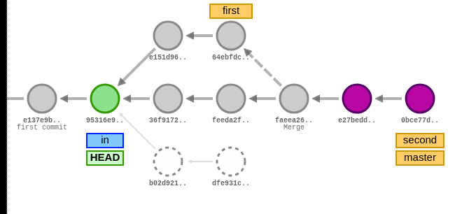

### Задача 1
На сайте https://onlywei.github.io/explain-git-with-d3 или http://git-school.github.io/visualizing-git/ (цвета могут отличаться, есть команды undo/redo) с помощью команд эмулятора git получить следующее состояние проекта (сливаем master с first, перебазируем second на master): см. картинку ниже. Прислать свою картинку.


```bash
git commit
git tag in
git branch first
git branch second
git commit
git commit
git checkout first
git commit
git commit
git checkout master
git merge first
git checkout second
git commit
git commit
git rebase master
git checkout master
git merge second
git checkout in
```


### Задача 2
```bash
# Инициализация локального репозитория
git init my_project
cd my_project

# Установка имени и почты для первого пользователя (coder1)
git config user.name "Coder 1"
git config user.email "coder1@corp.com"

# Создание файла prog.py с какими-то данными
nano prog.py
print('Hello, World!')

# Добавление файла в индекс
git add prog.py

# Создание коммита
git commit -m "new: добавлен файл prog.py"
```

```bash
xartd0@xartd0-System-Product-Name:~/Desktop/confupr/my_project$ git log
commit c23cfce606b7c7238c74660da3d7984c6b71e8df (HEAD -> master)
Author: Coder 1 <coder1@corp.com>
Date:   Thu Oct 31 23:13:54 2024 +0300

    new: добавлен файл prog.py
```

### Задача 3
```bash
# Инициализация первого репозитория и настройка
git init
git config user.name "coder1"
git config user.email "coder1@example.com"
echo 'print("Hello, World!")' > prog.py
git add prog.py
git commit -m "first commit"

# Создание bare-репозитория
mkdir -p repository
cd repository
git init --bare server

# Возвращение в основной репозиторий, подключение к серверу и пуш
cd ..
git remote add server repository/server
git remote -v
git push server master

# Клонирование серверного репозитория в клиентский
git clone repository/server repository/client
cd repository/client
git config user.name "coder2"
git config user.email "coder2@example.com"

# Добавление нового файла и коммит
echo "Author Information:" > readme.md
git add readme.md
git commit -m "docs"

# Переименование удаленного репозитория и пуш
git remote rename origin server
git push server master

# Возвращение в основной репозиторий, чтобы сделать pull
cd ..
git pull server master --no-rebase  # Используем merge вместо rebase

# Внесение изменений от coder1 и пуш
echo "Author: coder1" >> readme.md
git add readme.md
git commit -m "coder1 info"
git push server master

# Переход в клиентский репозиторий и внесение изменений от coder2
cd client
echo "Author: coder2" >> readme.md
git add readme.md
git commit -m "coder2 info"

# Перед `push` выполняем `pull` с merge, чтобы избежать линейной истории
git pull server master --no-rebase
git push server master

# Получение последних изменений с сервера
git pull server master --no-rebase

# Последний коммит и пуш исправлений в readme
git add readme.md
git commit -m "readme fix"
git push server master

# Переход к bare-репозиторию и просмотр истории
cd ..
cd server
git log -n 5 --graph --decorate --all
```


### Задача 4
Написать программу на Питоне (или другом ЯП), которая выводит список содержимого всех объектов репозитория. Воспользоваться командой "git cat-file -p". Идеальное решение – не использовать иных сторонних команд и библиотек для работы с git.
```bash
import os
import subprocess

def find_git_root(path):
    """Finds the root of the git repository containing the given path."""
    while path != os.path.dirname(path):
        if os.path.isdir(os.path.join(path, '.git')):
            return path
        path = os.path.dirname(path)
    return None

def main():
    # Find git root
    current_dir = os.getcwd()
    git_root = find_git_root(current_dir)
    if git_root is None:
        print('Not inside a git repository')
        return

    git_objects_dir = os.path.join(git_root, '.git', 'objects')

    # List to store object IDs
    object_ids = []

    # Walk through the .git/objects directory
    for root, dirs, files in os.walk(git_objects_dir):
        # Skip 'info' and 'pack' directories
        dirs[:] = [d for d in dirs if d not in ('info', 'pack')]

        for dir_name in dirs:
            dir_path = os.path.join(root, dir_name)
            for filename in os.listdir(dir_path):
                # Construct object ID
                object_id = dir_name + filename
                object_ids.append(object_id)

    # Remove duplicates (in case)
    object_ids = list(set(object_ids))

    # For each object ID, run "git cat-file -p <object_id>"
    for object_id in object_ids:
        try:
            output = subprocess.check_output(['git', 'cat-file', '-p', object_id], stderr=subprocess.STDOUT, cwd=git_root)
            print('Object ID:', object_id)
            print(output.decode('utf-8', errors='replace'))
            print('-' * 40)
        except subprocess.CalledProcessError as e:
            print('Error processing object ID:', object_id)
            print(e.output.decode('utf-8', errors='replace'))
            print('-' * 40)

if __name__ == '__main__':
    main()
```


```bash
Object ID: d1543adb5c79f21099b7d72971def24a03c3f2ea
Описание программы.

----------------------------------------
Object ID: 4b40f025e9fbb0c31eaa42da17756343e5397cd8
100644 blob 701322a79601818ed785c359c6112d21b818a415	main.py
100644 blob d1543adb5c79f21099b7d72971def24a03c3f2ea	readme.md

----------------------------------------
Object ID: 45739f748ded2febbddb10225b0017c9f38d02a3
tree 22b9ff87ad10a13ca4c5c43f0c4ea1b4c0f86cc1
parent 2ebf2b245924ac59d16d1f69fd99e3bc79155620
author Coder 1 <coder1@corp.com> 1730406938 +0300
committer Coder 1 <coder1@corp.com> 1730406938 +0300

coder1 info

----------------------------------------
Object ID: 22b9ff87ad10a13ca4c5c43f0c4ea1b4c0f86cc1
100644 blob 701322a79601818ed785c359c6112d21b818a415	main.py
100644 blob 785505f271a3d46ae853e6b63e5f2562f2940353	readme.md

----------------------------------------
Object ID: 701322a79601818ed785c359c6112d21b818a415
Initial code

----------------------------------------
Object ID: a45f05bfd5a456abcb186e991ecbea7d8d68ea08
100644 blob 701322a79601818ed785c359c6112d21b818a415	main.py

----------------------------------------
Object ID: cad8d7154a0f629459930d55394c10f87b54a9a5
tree a45f05bfd5a456abcb186e991ecbea7d8d68ea08
author Coder 1 <coder1@corp.com> 1730406825 +0300
committer Coder 1 <coder1@corp.com> 1730406825 +0300

first commit

----------------------------------------
Object ID: 785505f271a3d46ae853e6b63e5f2562f2940353
Описание программы.

## Авторы

- Coder 1

----------------------------------------
Object ID: 2ebf2b245924ac59d16d1f69fd99e3bc79155620
tree 4b40f025e9fbb0c31eaa42da17756343e5397cd8
parent cad8d7154a0f629459930d55394c10f87b54a9a5
author Coder 2 <coder2@corp.com> 1730406900 +0300
committer Coder 2 <coder2@corp.com> 1730406900 +0300

docs

----------------------------------------
```
