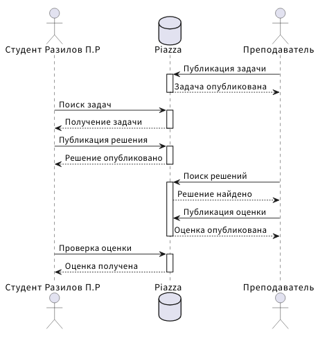

### Задача 1
Реализовать с помощью математического языка LaTeX нижеприведенную формулу:
Прислать код на LaTeX и картинку-результат, где, помимо формулы, будет указано ФИО студента.

```bash
\textbf{ФИО студента: Разилов Павел}
\int_x^\infty \frac{dt}{t(t^2 - 1) \log t} = \int_x^\infty \frac{1}{t \log t}\left( \sum_m t^{-2m} \right) dt = \sum_m \int_x^\infty \frac{t^{-2m}}{t \log t} dt \overset{u = t^{-2m}}{=} -\sum_m \mathrm{li}(x^{-2m})
```

### Задача 2
На языке PlantUML реализовать диаграмму на рисунке ниже. Прислать текст на PlantUML и картинку-результат, в которой ФИО студента заменены Вашими собственными. Обратите внимание на оформление, желательно придерживаться именно его, то есть без стандартного желтого цвета и проч. Чтобы много не писать используйте псевдонимы с помощью ключевого слова "as".

```bash
@startuml
skinparam lifelineStrategy nosolid
actor "Студент Разилов П.Р" as S
database Piazza as P
actor Преподаватель as T

T -> P : Публикация задачи
activate P
P --> T : Задача опубликована
deactivate P
...
S -> P : Поиск задач
activate P
P --> S : Получение задачи
deactivate P
...
S -> P : Публикация решения
activate P
P --> S : Решение опубликовано
deactivate P
...
T -> P : Поиск решений
activate P
P --> T : Решение найдено
T -> P : Публикация оценки
P --> T : Оценка опубликована
deactivate P
...
S -> P : Проверка оценки
activate P
P --> S : Оценка получена
deactivate P
@enduml
```

